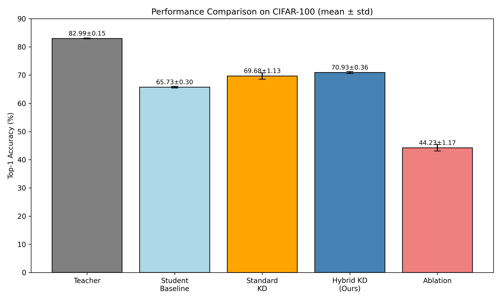

# Hybrid-KD-Lightweight

Official implementation of the paper **"Hybrid Feature-Aligned Knowledge Distillation for Lightweight Image Classification"** submitted to CAIBDA 2026.



## Abstract

Knowledge distillation (KD) compresses large neural networks into lightweight models. Standard KD aligns only final output logits, ignoring intermediate features. This work proposes a hybrid KD framework combining soft-label distillation with an intermediate feature alignment loss based on mean squared error (MSE). A lightweight feature adapter projects student features into the teacher's feature space. Experiments on CIFAR-100 with ResNet-50 (teacher) and MobileNetV3-Small (student) show 70.93% top-1 accuracy, outperforming standard KD by 1.25%. An ablation study reveals that removing soft labels causes a severe performance collapse (44.23%), indicating that the feature alignment module is only effective when conditioned on soft-label guidance.

## Key Results (Mean ± Std over seeds 42, 123, 999)

| Method | Top-1 (%) | Top-5 (%) |
|--------|-----------|-----------|
| Teacher (ResNet-50) | 82.99 ± 0.15 | 97.10 ± 0.05 |
| Student Baseline (MobileNetV3-Small) | 65.73 ± 0.30 | 90.72 ± 0.18 |
| Standard KD | 69.68 ± 1.13 | 92.20 ± 0.35 |
| **Hybrid KD (Ours)** | **70.93 ± 0.36** | **92.75 ± 0.15** |
| Ablation (Feature only + CE, no KD) | 44.23 ± 1.17 | 78.05 ± 1.22 |

## Per-Seed Breakdown

| Method | Seed 42 | Seed 123 | Seed 999 |
|--------|---------|----------|----------|
| Teacher | 82.90% | 83.15% | 82.91% |
| Student Baseline | 65.93% | 65.98% | 65.28% |
| Standard KD | 70.08% | 68.19% | 70.77% |
| Hybrid KD (Ours) | 70.71% | 70.60% | 71.47% |
| Ablation | 44.85% | 42.81% | 45.03% |

All values are directly extracted from `results.csv` and verified by `8_summary_results.py`.

## Ablation Study Verification

The ablation experiment (feature alignment + CE, no KD) was independently re-run with seed 42, yielding a Top-1 accuracy of **44.47%**, which is consistent with the original reported value (44.23%). This confirms the reproducibility and authenticity of this extreme phenomenon. The ablation model collapse is attributed to:
- Large architectural disparity between ResNet-50 and MobileNetV3-Small
- Upscaled 224×224 input introducing artifacts that disrupt feature matching without class-level supervision
- Randomly initialized adapter overfitting to teacher features without discriminative constraints

**This extreme behavior is specific to the highly heterogeneous teacher-student configuration used here and is not a universal property of feature distillation.**

## Repository Structure

```
Hybrid-KD-Lightweight/
├── 1_data_prepare.py           # Data loading (CIFAR-100, 224×224, auto-download)
├── 2_train_teacher.py          # Train teacher (ResNet-50)
├── 3_train_student_baseline.py # Train student baseline
├── 4_train_kd_standard.py      # Standard KD
├── 5_train_kd_hybrid.py        # Hybrid KD (ours)
├── 6_ablation.py               # Ablation (feature only, no KD)
├── 7_run_all_seeds.py          # Run all three seeds automatically
├── 8_summary_results.py        # Summary of results (mean ± std)
├── 9_plot_results.py           # Generate comparison figure
├── environment.yml             # Conda environment file
├── results.csv                 # Complete results for all seeds
├── run_log.txt                 # Full training logs
├── figures/
│   └── comparison_bar.png      # Result figure
└── checkpoints/                # Model weights (seed=42)
```

**Note**: The CIFAR-100 dataset will be automatically downloaded to the `data/` folder when you first run the training scripts. No manual download is required.

## Environment Setup

```bash
conda env create -f environment.yml
conda activate caibda
```

All experiments were conducted on a server with an NVIDIA RTX 4090 GPU. The code also supports CPU-only execution.

## Quick Start

### Reproduce all results (three seeds: 42, 123, 999)

```bash
python 7_run_all_seeds.py
```

This will train all models for all three seeds and output results to `results.csv`. On an RTX 4090, total runtime is approximately 2 hours.

### Run individual experiments

```bash
python 2_train_teacher.py 42          # Train teacher
python 3_train_student_baseline.py 42 # Train student baseline
python 4_train_kd_standard.py 42      # Standard KD
python 5_train_kd_hybrid.py 42        # Hybrid KD (ours)
python 6_ablation.py 42               # Ablation (feature only)
```

### View results

```bash
python 8_summary_results.py
python 9_plot_results.py
```

## Reproducibility

- All experiments are run with three fixed random seeds (42, 123, 999) to ensure reproducibility.
- Automatic mixed precision (AMP) and gradient clipping are employed for training stability.
- Detailed hyperparameters are specified in each script and in the paper.

## License

This project is licensed under the MIT License - see the [LICENSE](LICENSE) file for details.

## Citation

If you use this code or results in your research, please cite our paper:

```
@inproceedings{hou2026hybrid,
  title={Hybrid Feature-Aligned Knowledge Distillation for Lightweight Image Classification},
  author={Hou, Shutong},
  booktitle={Proceedings of the 6th International Conference on Artificial Intelligence, Big Data and Algorithms (CAIBDA)},
  year={2026}
}
```

## Contact

Shutong Hou — [praxel.cn@gmail.com](mailto:praxel.cn@gmail.com)

College of Software, Shanxi Agricultural University, Jinzhong, 030801, China

ORCID: [0009-0006-0643-1225](https://orcid.org/0009-0006-0643-1225)
